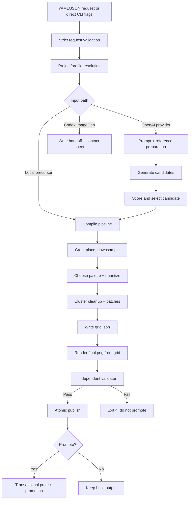

# Native Pixel Art Development Guide

[English](DEVELOPMENT.md) | [简体中文](DEVELOPMENT.zh-CN.md)

[User Manual](README.md)

This guide explains the implementation, extension points, invariants, test strategy, and release workflow of Native Pixel Art. It is intended for maintainers and contributors working on the Python package or the Codex Skill.

## Development principles

The implementation follows five rules:

1. **The generated image is a precursor.** Local code owns the final pixels.
2. **The grid is authoritative.** `final.png` must be rendered from `grid.json`.
3. **Validation is independent.** The validator reopens artifacts and does not reuse compiler repair logic.
4. **Hard constraints fail closed.** A failed dimension, palette, alpha, animation, or preview rule blocks promotion.
5. **Publication is transactional.** Staging, replacement, and promotion must avoid partially updated outputs.

Any change that weakens these properties should be treated as an architectural change, not a small implementation detail.

## Repository layout

```text
native-pixel-art/
├── SKILL.md                       # Codex Skill instructions and operational contract
├── README.md                      # English user manual
├── README.zh-CN.md                # Chinese user manual
├── DEVELOPMENT.md                 # English development guide
├── DEVELOPMENT.zh-CN.md           # Chinese development guide
├── pyproject.toml                 # Package metadata, dependencies, CLI entry point
├── uv.lock                        # Reproducible dependency lock
├── agents/openai.yaml             # Skill display metadata and default prompt
├── examples/                      # Compact request examples
├── palettes/                      # Built-in named palettes
├── references/                    # Skill policy and request reference material
├── schemas/                       # Generated request and manifest JSON Schemas
├── scripts/                       # Compatibility command wrappers
├── styles/                        # Legacy/simple style YAML files
├── tests/                         # Unit, CLI, project, and end-to-end tests
└── pixel_skill/
    ├── cli.py                     # Typer command surface and exit-code mapping
    ├── config.py                  # Strict Pydantic request and manifest models
    ├── project.py                 # Project discovery and profile resolution
    ├── references.py              # Project profiling and reference selection
    ├── prompt_compiler.py         # Structured precursor prompt planning
    ├── image_backend.py           # Backend protocol and errors
    ├── openai_image_backend.py    # Headless OpenAI image backend
    ├── candidate_selector.py      # Candidate scoring and deterministic selection
    ├── pipeline.py                # End-to-end compile and generation orchestration
    ├── crop.py                    # Foreground bounds, crop, and placement
    ├── downsample.py              # Native-size reduction and preview scaling
    ├── palette.py                 # Lab conversion and palette extraction
    ├── quantize.py                # Palette mapping and dithering
    ├── clusters.py                # Connected-component cleanup
    ├── animation.py               # Sheet splitting, assembly, and frame metrics
    ├── grid.py                    # Canonical grid, patches, and re-rendering
    ├── validator.py               # Independent hard/soft validation
    ├── semantic_review.py         # Non-authoritative semantic review
    ├── exporter.py                # PNG/JSON export and hashing
    ├── promotion.py               # Safe promotion into a project
    └── doctor.py                  # Installation and project health checks
```

## Set up a development environment

### uv

```bash
git clone https://github.com/hyfzero/native-pixel-art.git
cd native-pixel-art
uv sync --extra dev
uv run pixel-art --help
uv run pytest
uvx ruff check .
```

For OpenAI backend development:

```bash
uv sync --extra dev --extra openai
```

### pip

```bash
python -m venv .venv
python -m pip install -e ".[dev]"
python -m pytest
```

Install Ruff separately because it is used as a repository lint tool and is not currently part of the `dev` extra:

```bash
python -m pip install ruff
python -m ruff check .
```

For backend work:

```bash
python -m pip install -e ".[dev,openai]"
```

The package entry point is:

```toml
[project.scripts]
pixel-art = "pixel_skill.cli:app"
```

Changes in an editable install are immediately visible to the CLI.

## Architecture



### Control plane and data plane

The control plane consists of request validation, project/profile resolution, reference selection, backend selection, error mapping, and publication policy.

The data plane consists of RGBA image processing, native-size reduction, palette selection, quantization, cluster cleanup, grid conversion, rendering, and validation.

Keep these concerns separate. For example, backend configuration errors belong in the control plane; illegal pixels belong in the validator.

## Request model and schema

`pixel_skill/config.py` defines strict Pydantic models. Every model inherits from `StrictModel`, which sets `extra="forbid"`. Unknown fields therefore fail immediately.

The root request is `PixelArtRequest` with schema version `2`. Important cross-field checks include:

- `asset_id` must match `^[a-z][a-z0-9]*(?:_[a-z0-9]+)*$`;
- padding must leave drawable frame area;
- a solid background must belong to a fixed palette;
- opaque alpha converts a transparent background request to preserved behavior;
- multiple frames require `asset_type: animation`;
- animation cells must cover all requested frames;
- actions cannot exceed `frame_count`;
- exact fixed palettes must contain exactly `color_count` colors;
- promotion requires a target and a saved manifest;
- patches must remain bounded and semantically expressible.

### Legacy migration

The models intentionally migrate a small compatibility surface:

- missing `schema_version` becomes `2`;
- missing `asset_id` becomes `pixel_asset`;
- `prompt` and `description` populate each other;
- `max_colors` migrates to `color_count`;
- legacy generation `backend` maps to `provider`;
- legacy `candidates` maps to `variants`.

Do not silently migrate ambiguous behavior. Add compatibility only when the old meaning maps unambiguously to the new contract.

### Updating schemas

After changing request or manifest models, regenerate:

```python
from pixel_skill.config import write_schemas

write_schemas("schemas")
```

Then review both generated files:

- `schemas/request.schema.json`
- `schemas/manifest.schema.json`

Schema changes should be accompanied by tests and documentation updates. Breaking request changes require a schema-version decision.

## Project and profile resolution

`pixel_skill/project.py` discovers a project by walking upward for either:

- `project.godot`; or
- `tools/pixel_art/project.yaml`.

An explicit `project_root` takes precedence. The default project configuration path is `tools/pixel_art/project.yaml`, but `project_config` may override it.

Profile resolution is a deep merge with an important rule: **explicit request fields win**. Nested explicit fields also win independently. This allows a profile to set a complete palette policy while a request overrides only one nested value.

Project configuration schema version is currently `1`.

Example:

```yaml
schema_version: 1
work_dir: .godot/pixel_art_work
reference_catalog: reference_catalog.yaml
promotion_roots:
  - assets/generated
profiles:
  game_world_duotone: profiles/game_world_duotone.yaml
```

Profile:

```yaml
schema_version: 1
name: game_world_duotone
request_defaults:
  palette:
    mode: fixed
    colors: ["#000000", "#FEFEFE"]
    color_count: 2
    count_rule: exact
```

## Reference system

`profile-project` scans PNG files beneath `<project>/assets`.

The current built-in profiler recognizes:

- paths containing `game_world` as `game_world_duotone`;
- paths containing `room` as `room_color`.

Category inference uses directory names such as `boss`, `enemy`, `npc`, `character`, `item`, `tile`, `effect`, and `ui`.

The catalog stores path, profile, category, native dimensions, purpose, weight, and visible-color count. Automatic selection considers only the requested profile and ranks candidates by:

```text
score = weight × 4 + category bonus − logarithmic size distance
```

Exact same-category references receive the strongest bonus. Ties are resolved deterministically by path.

Reference artifacts include:

- `reference_stats.json`;
- a nearest-neighbor `reference_contact_sheet.png` when references exist.

When changing reference ranking, add deterministic tests covering category, weight, size, missing files, and minimum/maximum limits.

## Prompt compilation and generation

`PromptCompiler` produces a structured `PromptPlan`, not only a free-form string. It records:

- subject;
- silhouette requirement;
- composition;
- key features;
- forbidden details;
- semantic color roles;
- size-specific adaptations;
- generation prompt;
- negative constraints;
- project-profile guidance.

Native size changes the prompt policy. For example, an 8-pixel asset removes facial detail and thin lines, while a 32-pixel asset allows limited expressions and clothing detail.

### OpenAI backend

`OpenAIImageBackend`:

- requires `OPENAI_API_KEY`;
- imports the optional `openai` package lazily;
- uses image generation without references;
- uses image editing when one or more reference images are supplied;
- requests one image per variant;
- decodes base64 image responses;
- records operation metadata;
- rejects `seed` because support is not claimed.

Backend code must return precursor `PIL.Image` objects. It must not bypass the compiler or validator.

### Candidate selection

Candidates are scored on a downsampled trial using:

- target-scale coverage;
- color contrast;
- safe padding and complete silhouette;
- color complexity;
- edge density and estimated structure loss.

Selection uses the highest score, then the lowest original candidate index as a deterministic tie-breaker.

Candidate scoring is a heuristic, not a hard validator. Keep subjective selection separate from technical acceptance.

## Compile pipeline in detail

`compile_image` is the main orchestrator.

### 1. Resolve request and output

Project defaults are merged, the output directory is resolved, duplicate output is checked, and promotion targets are preflighted.

Project builds default to:

```text
<project>/.godot/pixel_art_work/<asset_id>
```

### 2. Create a unique staging directory

The pipeline writes to:

```text
.<output-name>.tmp-<uuid>
```

An exception removes only that run's staging directory.

### 3. Load source and references

The source is converted to RGBA. Reference selection and reference artifacts happen before frame compilation. Animation sheets are split into frame cells.

### 4. Prepare each frame

Background behavior is applied first:

- transparent mode estimates the median border color and removes pixels within an adaptive distance threshold;
- solid mode alpha-composites the source onto the configured color;
- preserve mode retains RGBA content.

The visible subject is cropped, placed on a working canvas, and reduced to the requested frame size. The working canvas is at least four times the target dimensions to keep placement controlled before downsampling.

### 5. Normalize alpha

Binary mode thresholds alpha at `128`, resulting in only `0` and `255`. RGB beneath fully transparent pixels is cleared to black.

Opaque mode composites pixels onto the configured background color and forces alpha to `255`.

### 6. Choose a canonical palette

- Fixed mode converts the request HEX values directly.
- Adaptive mode extracts a deterministic Lab-space palette.
- Reference mode samples each reference independently before merging, avoiding large-image dominance.
- Exact reference palettes try to choose reference-derived colors that remain distinguishable in the actual source.
- Semantic mode extracts role-specific colors through masks, then fills remaining capacity from the source.

Palette extraction uses deterministic weighted clustering in CIE Lab space. Stable sorts and deterministic initial-center selection avoid random behavior.

### 7. Quantize and clean

Quantization maps visible pixels to the canonical palette. Supported dithering values are:

- `off` or `none`;
- `ordered-bayer-2`;
- `ordered-bayer-4`;
- `floyd-steinberg`.

Project profiles generally keep dithering off. Error diffusion must never flow through transparent pixels.

Optional cluster cleanup finds color-specific connected components with 4- or 8-connectivity. Regions below `minimum_cluster_size` are merged into a nearby adjacent color or removed when no visible neighbor exists. Protected-mask pixels are preserved.

### 8. Convert to the canonical grid

Every visible pixel becomes a palette index; transparency uses `-1`. Patches are applied to frame-local grids and must use the canonical palette.

`grid.json` stores:

- schema version;
- asset identity and type;
- canonical palette;
- transparent index;
- frame dimensions and count;
- sheet columns and rows;
- every frame's index grid.

### 9. Render from the grid

The compiler does not save the cleaned image as the final authority. It calls `render_grid_file` and constructs `final.png` from the serialized grid.

This round trip is essential: if grid serialization cannot reproduce the image, the pipeline should fail rather than hide the mismatch.

### 10. Export and validate

The exporter writes:

- `final.png`;
- integer-scale preview;
- palette strip;
- hashes and supporting JSON artifacts.

The validator reopens the saved PNG and optionally the preview. It checks:

- PNG format;
- exact output dimensions;
- visible/countable color count;
- fixed-palette membership;
- required fixed colors in exact mode;
- binary alpha;
- fully opaque mode;
- black RGB beneath transparency;
- animation frame occupancy;
- unused animation-cell emptiness;
- anchor and baseline drift;
- preview dimensions and exact nearest-neighbor pixels;
- non-empty content.

Border contact, unusual coverage, and small clusters are soft warnings. They do not override hard success.

### 11. Publish and optionally promote

The staging directory replaces the output directory through backup-and-rename logic. If replacement fails, the previous output is restored.

Promotion occurs only after successful validation. It separately stages every destination file, backs up existing targets when overwrite is enabled, commits the staged files, and rolls back on failure.

## Manifest and reproducibility

The manifest contains:

- normalized request;
- structured prompt plan;
- canonical palette;
- selected references;
- candidate scores;
- frame manifest;
- processing and cleanup statistics;
- file paths and SHA-256 hashes;
- backend identity and operation records;
- semantic review;
- promotion results.

The image backend may be nondeterministic, but compilation of the same precursor and request is designed to be deterministic. When debugging reproducibility, compare the request, precursor hash, reference list, palette, grid, and output hashes rather than relying only on visual inspection.

## CLI and exit-code mapping

The Typer surface lives in `pixel_skill/cli.py`.

Commands:

- `generate`
- `compile`
- `animate`
- `validate`
- `analyze-style`
- `profile-project`
- `doctor`
- `palette extract`
- `preview`

Exit codes are part of the public interface:

| Code | Owner | Meaning |
| ---: | --- | --- |
| `0` | Command | Success |
| `2` | CLI/config/compiler | Invalid configuration, schema, input, or compile error |
| `3` | Backend | Backend unavailable/refused, or Codex handoff prepared |
| `4` | Validator | Hard technical validation failure |
| `5` | Doctor | Required environment/project check failed |
| `6` | Publisher | Existing output without explicit overwrite |

Preserve these meanings when adding commands. Avoid collapsing technical validation failures into generic configuration errors.

## Adding or changing functionality

### Add a CLI command

1. Add a small Typer command in `cli.py`.
2. Keep implementation logic in a focused module.
3. Map known errors to the established exit codes.
4. Add a CLI test with `typer.testing.CliRunner`.
5. Update both README files and command-surface tests.

### Add an image backend

1. Implement the `ImageBackend` protocol or equivalent typed surface.
2. Return RGBA precursor images only.
3. Define explicit configuration and unsupported-option errors.
4. Record backend metadata without secrets.
5. Never write final assets directly.
6. Add mocked tests; network access must not be required by the test suite.

### Add a palette strategy

1. Define its request fields and cross-field validation.
2. Keep palette selection deterministic.
3. Exclude transparent pixels from visible-color extraction.
4. Quantize only after native-size reduction.
5. Add exact and maximum-count tests.
6. Add a corrupt-output validator test when applicable.

### Add a validation rule

1. Decide whether it is hard or soft.
2. Give it a stable machine-readable code.
3. Reopen saved artifacts for the check.
4. Avoid calling compiler repair functions.
5. Add passing and failing tests.
6. Document user remediation.

### Add a project profile

Project-specific profiles normally belong in the consuming game repository, not in this package. If a reusable built-in behavior is necessary:

1. keep the algorithm generic;
2. keep project choices in YAML;
3. add profile-resolution tests;
4. verify explicit request overrides;
5. update reference-selection documentation.

## Testing strategy

Run:

```bash
uv run pytest
uvx ruff check .
git diff --check
```

The current suites cover:

- `tests/test_core.py`: grid round trips, palette constraints, animation, corruption, duplicate output, cleanup, interruption, promotion, schema, and backend behavior;
- `tests/test_cli.py`: command compatibility, flags, exit codes, and command discovery;
- `tests/test_project.py`: project defaults, explicit overrides, references, catalog, and statistics;
- `tests/test_examples.py`: end-to-end compilation of bundled example requests.

### Test design rules

- Use temporary directories for every output.
- Construct tiny deterministic images locally.
- Do not require API keys or network access.
- Mock image backends.
- Test saved artifacts, not only in-memory objects.
- For failure tests, assert both exit code and stable validation/error code.
- Verify rollback and preservation behavior around destructive boundaries.

### Minimum checks by change type

| Change | Required checks |
| --- | --- |
| Documentation only | Link/path review, `git diff --check`, full tests if commands or contracts were described differently |
| Config model | Unit tests, schemas regenerated, full suite, both manuals updated |
| Pixel pipeline | Focused image tests, corruption test, full suite, Ruff |
| CLI | CliRunner test, command help review, exit-code test |
| Backend | Mocked success/failure tests, secret review, full suite |
| Promotion/output | Duplicate, overwrite, interruption, rollback, and path-boundary tests |

## Debugging

Enable:

```yaml
export:
  save_intermediate: true
```

Then inspect:

1. `00_source.png`;
2. `frame_XX_01_cropped.png`;
3. `frame_XX_02_downsampled.png`;
4. `frame_XX_03_quantized.png`;
5. `frame_XX_04_cleaned.png`;
6. `grid.json`;
7. `final.png`;
8. `validation_report.json`;
9. `manifest.json`.

Use the first stage where the result diverges from expectation to locate ownership:

- crop/placement issue: `crop.py` or composition config;
- color issue: `palette.py` or `quantize.py`;
- lost semantic pixel: `clusters.py`, protected mask, or patch;
- sheet issue: `animation.py` or animation config;
- grid mismatch: `grid.py`;
- acceptance issue: `validator.py`;
- path/overwrite issue: `project.py`, `pipeline.py`, or `promotion.py`.

## Security and safety

- Never record `OPENAI_API_KEY` in manifests or backend metadata.
- Do not treat API output as trusted image data; decoding and compilation may fail.
- Resolve project-relative paths before checking promotion boundaries.
- Keep promotion within configured roots.
- Refuse duplicate outputs by default.
- Avoid editing engine scene files or generated import metadata.
- Clean only the current run's uniquely named staging directory on failure.
- Preserve existing outputs unless overwrite is explicit.

## Documentation maintenance

The language switch at the top of each manual must remain valid:

- `README.md` ↔ `README.zh-CN.md`
- `DEVELOPMENT.md` ↔ `DEVELOPMENT.zh-CN.md`

When behavior changes, update both language versions in the same commit. Command examples should be runnable, and field names must match `PixelArtRequest`.

## Release checklist

1. Confirm `pyproject.toml` version.
2. Run the full test suite.
3. Run Ruff and `git diff --check`.
4. Regenerate schemas if models changed.
5. Confirm both user manuals and both development guides agree.
6. Test a fresh editable installation.
7. Run `pixel-art doctor`.
8. Compile at least one static example and one animation example.
9. Inspect `manifest.json`, `grid.json`, preview, and validation report.
10. Confirm no API keys, local absolute paths, virtual environments, caches, or generated output are staged.

## Contribution checklist

Before opening a pull request:

- keep the change focused;
- add regression tests;
- preserve deterministic behavior;
- preserve grid authority and independent validation;
- preserve exit-code semantics;
- document new request fields and commands in both languages;
- explain any schema or output-contract change;
- include the commands used to validate the change.
