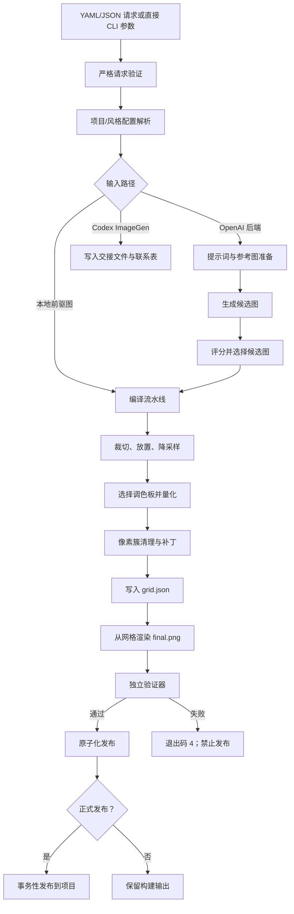

# Native Pixel Art 开发手册

[English](DEVELOPMENT.md) | [简体中文](DEVELOPMENT.zh-CN.md)

[用户手册](README.zh-CN.md)

本手册介绍 Native Pixel Art 的实现结构、扩展点、核心不变量、测试策略和发布流程，面向维护 Python 包或 Codex Skill 的开发者。

## 开发原则

项目实现遵守五条规则：

1. **生成图片只是前驱图。** 最终像素由本地代码决定。
2. **网格是权威数据。** `final.png` 必须由 `grid.json` 渲染产生。
3. **验证必须独立。** 验证器重新打开产物，不复用编译器的修复逻辑。
4. **硬约束默认拒绝。** 尺寸、调色板、透明度、动画或预览规则失败时必须阻止发布。
5. **输出发布具有事务性。** 暂存、替换和正式发布不能留下部分更新的结果。

任何削弱这些性质的改动，都应当被视为架构变更，而不是普通实现细节。

## 仓库结构

```text
native-pixel-art/
├── SKILL.md                       # Codex Skill 指令和运行契约
├── README.md                      # 英文用户手册
├── README.zh-CN.md                # 中文用户手册
├── DEVELOPMENT.md                 # 英文开发手册
├── DEVELOPMENT.zh-CN.md           # 中文开发手册
├── pyproject.toml                 # 包元数据、依赖和 CLI 入口
├── uv.lock                        # 可复现依赖锁文件
├── agents/openai.yaml             # Skill 展示信息和默认提示
├── examples/                      # 精简请求示例
├── palettes/                      # 内置命名调色板
├── references/                    # Skill 策略与请求参考资料
├── schemas/                       # 生成的请求和清单 JSON Schema
├── scripts/                       # 兼容命令包装脚本
├── styles/                        # 旧版/简化风格 YAML
├── tests/                         # 单元、CLI、项目和端到端测试
└── pixel_skill/
    ├── cli.py                     # Typer 命令和退出码映射
    ├── config.py                  # 严格 Pydantic 请求与清单模型
    ├── project.py                 # 项目发现和风格配置解析
    ├── references.py              # 项目分析和参考图选择
    ├── prompt_compiler.py         # 结构化前驱图提示词规划
    ├── image_backend.py           # 后端协议和错误类型
    ├── openai_image_backend.py    # 无界面 OpenAI 图像后端
    ├── candidate_selector.py      # 候选评分和确定性选择
    ├── pipeline.py                # 编译和生成的端到端编排
    ├── crop.py                    # 前景边界、裁切与放置
    ├── downsample.py              # 原生尺寸缩减和预览放大
    ├── palette.py                 # Lab 转换与调色板提取
    ├── quantize.py                # 调色板映射和抖动
    ├── clusters.py                # 连通区域清理
    ├── animation.py               # 精灵表切分、组装和帧指标
    ├── grid.py                    # 权威网格、补丁和重新渲染
    ├── validator.py               # 独立的硬/软验证
    ├── semantic_review.py         # 非权威语义审查
    ├── exporter.py                # PNG/JSON 导出与哈希
    ├── promotion.py               # 安全发布到项目
    └── doctor.py                  # 安装和项目健康检查
```

## 搭建开发环境

### uv

```bash
git clone https://github.com/hyfzero/native-pixel-art.git
cd native-pixel-art
uv sync --extra dev
uv run pixel-art --help
uv run pytest
uvx ruff check .
```

开发 OpenAI 后端时：

```bash
uv sync --extra dev --extra openai
```

### pip

```bash
python -m venv .venv
python -m pip install -e ".[dev]"
python -m pytest
```

Ruff 当前是仓库级检查工具，不在 `dev` 扩展中，需要单独安装：

```bash
python -m pip install ruff
python -m ruff check .
```

开发图像后端时：

```bash
python -m pip install -e ".[dev,openai]"
```

包的命令入口为：

```toml
[project.scripts]
pixel-art = "pixel_skill.cli:app"
```

可编辑安装下的代码修改会立即反映到 CLI。

## 架构



### 控制面与数据面

控制面包括请求验证、项目/风格配置解析、参考图选择、后端选择、错误映射和发布策略。

数据面包括 RGBA 图像处理、原生尺寸缩减、调色板选择、颜色量化、像素簇清理、网格转换、渲染和验证。

应保持两者分离。例如，后端配置错误属于控制面，非法像素属于验证器。

## 请求模型与 Schema

`pixel_skill/config.py` 定义严格的 Pydantic 模型。所有模型继承 `StrictModel`，并设置 `extra="forbid"`，因此未知字段会立即失败。

根请求为 `PixelArtRequest`，Schema 版本为 `2`。主要跨字段检查包括：

- `asset_id` 必须匹配 `^[a-z][a-z0-9]*(?:_[a-z0-9]+)*$`；
- padding 必须给帧留下可绘制区域；
- 纯色背景必须属于固定调色板；
- 不透明 Alpha 会把透明背景请求转为保留背景行为；
- 多帧必须使用 `asset_type: animation`；
- 动画单元格数量必须覆盖全部请求帧；
- 动作范围不能超出 `frame_count`；
- 精确固定调色板必须恰好包含 `color_count` 个颜色；
- 正式发布必须配置目标并保存清单；
- 补丁必须有界且能用明确语义表达。

### 旧版兼容迁移

模型保留了少量明确的兼容迁移：

- 缺少 `schema_version` 时设为 `2`；
- 缺少 `asset_id` 时设为 `pixel_asset`；
- `prompt` 和 `description` 可以互相补全；
- `max_colors` 迁移为 `color_count`；
- 旧 `generation.backend` 映射到 `provider`；
- 旧 `candidates` 映射到 `variants`。

不要静默迁移含义不明确的行为。只有旧含义能够无歧义映射到新契约时，才应增加兼容逻辑。

### 更新 Schema

修改请求或清单模型后，重新生成：

```python
from pixel_skill.config import write_schemas

write_schemas("schemas")
```

然后检查：

- `schemas/request.schema.json`
- `schemas/manifest.schema.json`

Schema 改动必须配套测试和文档。破坏兼容性的请求变更需要明确决定是否提升 Schema 版本。

## 项目与风格配置解析

`pixel_skill/project.py` 向上查找以下任一文件来发现项目：

- `project.godot`；
- `tools/pixel_art/project.yaml`。

显式 `project_root` 优先。默认项目配置路径是 `tools/pixel_art/project.yaml`，也可通过 `project_config` 覆盖。

风格配置使用深度合并，但有一条重要规则：**请求中显式字段优先**。嵌套字段也独立遵守此规则。因此风格配置可以定义完整调色板策略，而单个请求只覆盖其中一个嵌套值。

项目配置 Schema 版本当前为 `1`。

示例：

```yaml
schema_version: 1
work_dir: .godot/pixel_art_work
reference_catalog: reference_catalog.yaml
promotion_roots:
  - assets/generated
profiles:
  game_world_duotone: profiles/game_world_duotone.yaml
```

风格配置：

```yaml
schema_version: 1
name: game_world_duotone
request_defaults:
  palette:
    mode: fixed
    colors: ["#000000", "#FEFEFE"]
    color_count: 2
    count_rule: exact
```

## 参考图系统

`profile-project` 扫描 `<project>/assets` 下的 PNG。

当前内置分析器识别：

- 路径包含 `game_world` 时使用 `game_world_duotone`；
- 路径包含 `room` 时使用 `room_color`。

类别推断使用 `boss`、`enemy`、`npc`、`character`、`item`、`tile`、`effect`、`ui` 等目录名。

目录记录路径、风格、类别、原生尺寸、用途、权重和可见颜色数。自动选择只考虑请求的风格配置，并按以下公式排序：

```text
score = weight × 4 + category bonus − logarithmic size distance
```

同类别参考图获得最高加分。分数相同时按路径确定性排序。

参考图产物包括：

- `reference_stats.json`；
- 存在参考图时生成最近邻缩放的 `reference_contact_sheet.png`。

修改参考图排序时，应增加覆盖类别、权重、尺寸、文件缺失和最小/最大数量限制的确定性测试。

## 提示词编译与图像生成

`PromptCompiler` 产出结构化的 `PromptPlan`，而不仅是一段自由文本。它记录：

- 主体；
- 轮廓要求；
- 构图；
- 关键特征；
- 禁止细节；
- 语义颜色角色；
- 尺寸适配规则；
- 生成提示词；
- 负面约束；
- 项目风格指导。

原生尺寸会改变提示策略。例如，8 像素资源会去除面部细节和细线，32 像素资源则允许有限表情和服装细节。

### OpenAI 后端

`OpenAIImageBackend`：

- 要求存在 `OPENAI_API_KEY`；
- 延迟导入可选 `openai` 包；
- 没有参考图时调用图像生成；
- 有一个或多个参考图时调用图像编辑；
- 每个 variant 请求一张图；
- 解码 base64 图片响应；
- 记录操作元数据；
- 因未声明支持而拒绝 `seed`。

后端代码必须返回前驱 `PIL.Image` 对象，不得绕过编译器或验证器。

### 候选图选择

候选图会在试验性降采样后按以下指标评分：

- 目标比例覆盖率；
- 颜色对比度；
- 安全留白和完整轮廓；
- 颜色复杂度；
- 边缘密度和估算结构损失。

选择最高分；同分时选择原始序号更小的候选图，从而保持确定性。

候选评分只是启发式选择，不是硬性验证。主观候选选择和技术验收必须保持分离。

## 编译流水线详解

`compile_image` 是主要编排入口。

### 1. 解析请求与输出

合并项目默认值，解析输出目录，检查重复输出，并预检正式发布目标。

项目构建默认输出到：

```text
<project>/.godot/pixel_art_work/<asset_id>
```

### 2. 创建唯一暂存目录

流水线写入：

```text
.<output-name>.tmp-<uuid>
```

发生异常时只删除当前运行的暂存目录。

### 3. 加载源图与参考图

源图转换为 RGBA。选择参考图并写入参考图产物，然后开始帧编译。动画精灵表会先切分为帧单元。

### 4. 准备每一帧

首先应用背景行为：

- 透明模式估算边界颜色中位数，并使用自适应距离阈值去除背景；
- 纯色模式把源图 Alpha 合成到配置颜色；
- 保留模式保留 RGBA 内容。

随后裁切可见主体，将其放到工作画布，并缩减到请求的帧尺寸。工作画布至少是目标尺寸的四倍，以便在降采样前保持可控布局。

### 5. 规范化 Alpha

二值模式以 `128` 为阈值，把 Alpha 限制为 `0` 或 `255`，并把完全透明像素下的 RGB 清为黑色。

不透明模式把像素合成到配置背景色，并强制 Alpha 为 `255`。

### 6. 选择权威调色板

- 固定模式直接转换请求中的 HEX 值；
- 自适应模式在 Lab 空间确定性提取调色板；
- 参考图模式会先独立采样每张参考图再合并，避免大图支配结果；
- 精确参考调色板会尝试选择在实际源图中仍可区分的参考图颜色；
- 语义模式通过遮罩提取角色颜色，再从源图补足剩余容量。

调色板提取使用 CIE Lab 空间中的确定性加权聚类。稳定排序和确定性的初始中心选择避免随机行为。

### 7. 量化与清理

颜色量化把可见像素映射到权威调色板。支持的抖动值：

- `off` 或 `none`；
- `ordered-bayer-2`；
- `ordered-bayer-4`；
- `floyd-steinberg`。

项目风格通常关闭抖动。误差扩散不得穿过透明像素。

可选像素簇清理使用 4 邻接或 8 邻接查找颜色独立的连通区域。小于 `minimum_cluster_size` 的区域会合并到邻近颜色；没有可见邻居时会被移除。受保护遮罩内的像素必须保留。

### 8. 转换为权威网格

每个可见像素转换为调色板索引，透明像素使用 `-1`。补丁作用于帧内网格，并且必须使用权威调色板。

`grid.json` 保存：

- Schema 版本；
- 资源身份和类型；
- 权威调色板；
- 透明索引；
- 帧尺寸和数量；
- 精灵表列数和行数；
- 每一帧的索引网格。

### 9. 从网格渲染

编译器不会把清理后的内存图片直接当作最终权威资源，而是调用 `render_grid_file`，从序列化网格构造 `final.png`。

这个往返过程是必要的：如果网格序列化不能复现图片，流水线应该失败，而不是隐藏不一致。

### 10. 导出并验证

导出器写入：

- `final.png`；
- 整数倍预览图；
- 调色板条；
- 哈希和配套 JSON 产物。

验证器重新打开保存的 PNG，并按需打开预览图，检查：

- PNG 格式；
- 精确输出尺寸；
- 可见/计数颜色数；
- 固定调色板成员关系；
- 精确模式下必需颜色是否实际使用；
- 二值 Alpha；
- 完全不透明模式；
- 透明像素下 RGB 是否为黑色；
- 动画帧是否有内容；
- 未使用动画单元格是否为空；
- 锚点和基线漂移；
- 预览图尺寸和像素是否严格最近邻；
- 最终内容是否为空。

触碰边界、覆盖率异常和小像素簇属于软警告，不会覆盖硬性成功状态。

### 11. 发布并按需正式复制

暂存目录通过“备份 + 重命名”替换输出目录。替换失败时恢复旧输出。

只有验证成功后才执行正式发布。发布过程会分别暂存每个目标文件，在允许覆盖时备份旧目标，提交暂存文件，并在失败时回滚。

## 清单与可复现性

清单包含：

- 规范化请求；
- 结构化提示词规划；
- 权威调色板；
- 选中参考图；
- 候选评分；
- 帧清单；
- 处理和清理统计；
- 文件路径与 SHA-256；
- 后端身份和操作记录；
- 语义审查；
- 正式发布结果。

图像后端可能不具备确定性，但相同前驱图和请求的本地编译应保持确定性。排查可复现性时，应比较请求、前驱图哈希、参考图列表、调色板、网格和输出哈希，而不是只靠肉眼。

## CLI 与退出码映射

Typer 命令位于 `pixel_skill/cli.py`。

命令包括：

- `generate`
- `compile`
- `animate`
- `validate`
- `analyze-style`
- `profile-project`
- `doctor`
- `palette extract`
- `preview`

退出码是公共接口的一部分：

| 退出码 | 责任模块 | 含义 |
| ---: | --- | --- |
| `0` | 命令 | 成功 |
| `2` | CLI/配置/编译器 | 配置、Schema、输入或编译错误 |
| `3` | 后端 | 后端不可用/拒绝，或已准备 Codex 交接 |
| `4` | 验证器 | 硬性技术验证失败 |
| `5` | Doctor | 必需的环境/项目检查失败 |
| `6` | 发布器 | 输出已存在但没有显式覆盖 |

增加命令时应保留这些含义，不要把技术验证失败压缩成普通配置错误。

## 增加或修改功能

### 增加 CLI 命令

1. 在 `cli.py` 中增加薄 Typer 命令；
2. 把实现逻辑放入职责单一的模块；
3. 把已知错误映射到既有退出码；
4. 使用 `typer.testing.CliRunner` 增加 CLI 测试；
5. 更新两份 README 和命令面测试。

### 增加图像后端

1. 实现 `ImageBackend` 协议或等价的类型化接口；
2. 只返回 RGBA 前驱图；
3. 定义明确的配置错误和不支持选项错误；
4. 记录不含密钥的后端元数据；
5. 禁止直接写入最终资源；
6. 使用 mock 增加测试，测试套件不能依赖网络。

### 增加调色板策略

1. 定义请求字段和跨字段验证；
2. 保持调色板选择确定性；
3. 提取可见颜色时排除透明像素；
4. 只在原生尺寸缩减后执行量化；
5. 增加精确数量和最大数量测试；
6. 必要时增加损坏输出的验证器测试。

### 增加验证规则

1. 决定规则属于硬失败还是软警告；
2. 分配稳定的机器可读错误码；
3. 重新打开保存的产物执行检查；
4. 不调用编译器修复函数；
5. 增加通过和失败测试；
6. 在用户文档中说明修复方式。

### 增加项目风格

项目专属风格通常应放在使用本工具的游戏仓库，而不是本包。如果确实需要可复用的内置行为：

1. 保持算法通用；
2. 把项目选择保留在 YAML；
3. 增加风格解析测试；
4. 验证请求显式字段仍然优先；
5. 更新参考图选择文档。

## 测试策略

运行：

```bash
uv run pytest
uvx ruff check .
git diff --check
```

当前测试覆盖：

- `tests/test_core.py`：网格往返、调色板约束、动画、损坏文件、重复输出、清理、中断、发布、Schema 和后端行为；
- `tests/test_cli.py`：命令兼容、参数、退出码和命令发现；
- `tests/test_project.py`：项目默认值、显式覆盖、参考图、目录和统计；
- `tests/test_examples.py`：内置示例请求的端到端编译。

### 测试设计规则

- 每次输出都使用临时目录；
- 在本地构造小型确定性图片；
- 不要求 API Key 或网络；
- 图像后端使用 mock；
- 验证磁盘产物，而不仅是内存对象；
- 失败测试同时断言退出码和稳定错误码；
- 在破坏性边界附近验证回滚和保留行为。

### 不同改动的最低检查要求

| 改动 | 必需检查 |
| --- | --- |
| 纯文档 | 链接/路径检查、`git diff --check`；如果命令或契约描述变化则运行全量测试 |
| 配置模型 | 单元测试、重新生成 Schema、全量测试、更新两种语言手册 |
| 像素流水线 | 针对性图像测试、损坏文件测试、全量测试、Ruff |
| CLI | CliRunner 测试、检查命令帮助、退出码测试 |
| 后端 | mock 成功/失败测试、密钥检查、全量测试 |
| 发布/输出 | 重复、覆盖、中断、回滚和路径边界测试 |

## 调试

启用：

```yaml
export:
  save_intermediate: true
```

按顺序检查：

1. `00_source.png`；
2. `frame_XX_01_cropped.png`；
3. `frame_XX_02_downsampled.png`；
4. `frame_XX_03_quantized.png`；
5. `frame_XX_04_cleaned.png`；
6. `grid.json`；
7. `final.png`；
8. `validation_report.json`；
9. `manifest.json`。

找到第一个偏离预期的阶段即可确定责任范围：

- 裁切/布局问题：`crop.py` 或构图配置；
- 颜色问题：`palette.py` 或 `quantize.py`；
- 语义像素丢失：`clusters.py`、保护遮罩或补丁；
- 精灵表问题：`animation.py` 或动画配置；
- 网格不一致：`grid.py`；
- 验收问题：`validator.py`；
- 路径/覆盖问题：`project.py`、`pipeline.py` 或 `promotion.py`。

## 安全要求

- 禁止把 `OPENAI_API_KEY` 写入清单或后端元数据；
- 不要信任 API 输出，解码和编译都可能失败；
- 检查正式发布边界前先解析项目相对路径；
- 正式发布必须限制在配置的根目录内；
- 默认拒绝重复输出；
- 不编辑游戏引擎场景文件或生成的导入元数据；
- 失败时只清理当前运行的唯一暂存目录；
- 除非显式覆盖，否则保留已有输出。

## 文档维护

每份手册顶部的语言切换必须始终有效：

- `README.md` ↔ `README.zh-CN.md`
- `DEVELOPMENT.md` ↔ `DEVELOPMENT.zh-CN.md`

行为变化时，必须在同一个提交中更新两个语言版本。命令示例应可运行，字段名必须与 `PixelArtRequest` 一致。

## 发布检查清单

1. 确认 `pyproject.toml` 版本；
2. 运行完整测试；
3. 运行 Ruff 和 `git diff --check`；
4. 如果模型变化，重新生成 Schema；
5. 确认两份用户手册和两份开发手册内容一致；
6. 测试全新的可编辑安装；
7. 运行 `pixel-art doctor`；
8. 至少编译一个静态示例和一个动画示例；
9. 检查 `manifest.json`、`grid.json`、预览图和验证报告；
10. 确认暂存区没有 API Key、本地绝对路径、虚拟环境、缓存或生成输出。

## 贡献检查清单

创建拉取请求前：

- 保持改动范围集中；
- 增加回归测试；
- 保持确定性行为；
- 保持网格权威性和独立验证；
- 保持退出码语义；
- 在两种语言文档中记录新字段和命令；
- 解释任何 Schema 或输出契约变化；
- 写明用于验证改动的命令。
